# Hackergame 2024 旅行照片4.0 WriteUp By 燃灯琉璃

### 前言
今年是第三年做旅行照片这类的社会工程学题目了，这还是第一次写自己的思路和解法呢。这次的题目跟前几年的题目一样充满乐趣，~~一度让我怀疑出题者里面是不是有交通运输迷~~，虽然解题的过程遇到了不少的困难，不过最后还是解出来了，在此感谢组委会的辛勤付出！
***  

## 问题一
问题 1: 照片拍摄的位置距离中科大的哪个校门更近？（格式：X校区Y门，均为一个汉字）  
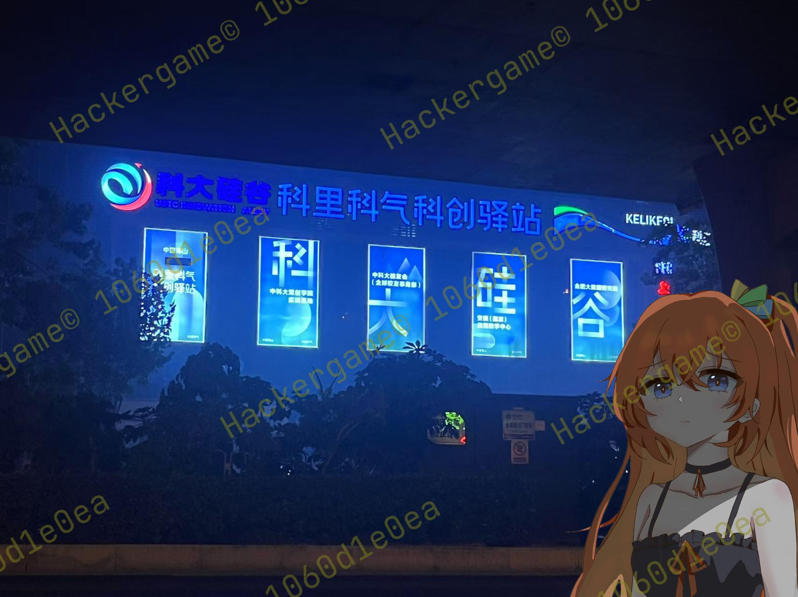  

这道题咋一看很简单，但实际做的时候遇到了一些小坑。首先从图片中的“科大硅谷”“科里科气科创驿站”两个地点关键词入手，首先打开百度地图尝试直接搜索该地址，首先发现地图搜索结果出现了近10条搜索结果，第一个匹配最高的是位于此处的地点：  

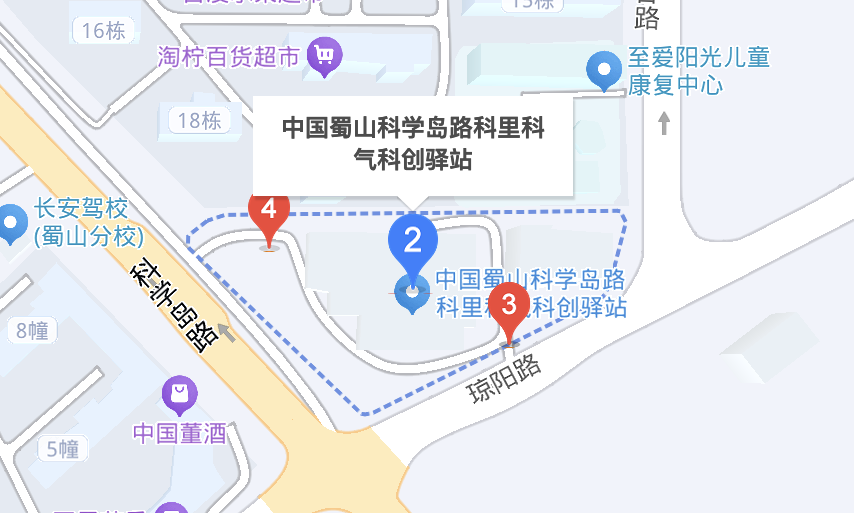  

但经过百度街景查看附近并无类似建筑，并且该地位于各个校区地区较远，所以排除掉这个地点，继续看搜索给出的其他结果。继续看到下一个地点，该地位于两个校区中间，经过百度地图的相册和街景确认为该地址。

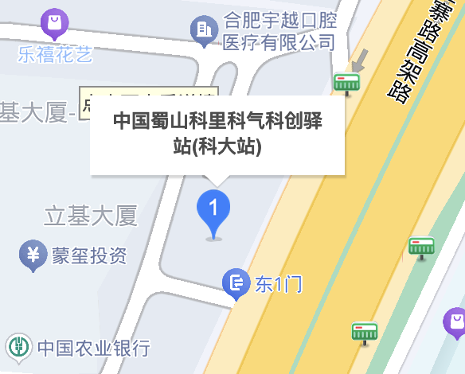
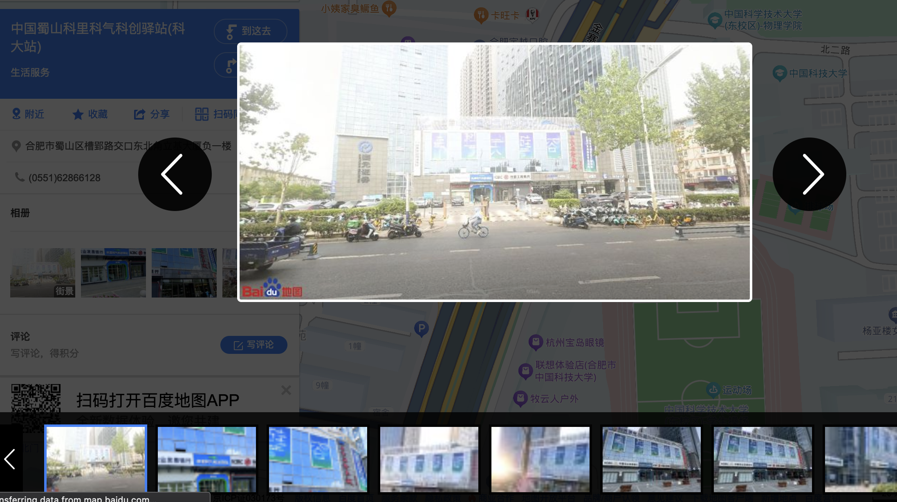  

经查看离该地点最近的中科大校园校门为:  

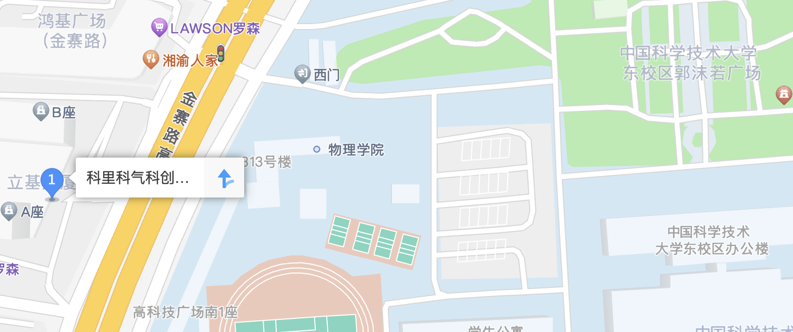  

即该题答案为：东校区西门  

***
## 问题二
话说 Leo 酱上次出现在桁架上是……科大今年的 ACG 音乐会？活动日期我没记错的话是？（格式：YYYYMMDD）  

该题非常简单就能答案，根据科大，Leo酱与ACG音乐会相关关键词，我们能够直接找到他们的B站账户“中科大Leo动漫协会“。往下翻阅动态即可找到答案。  

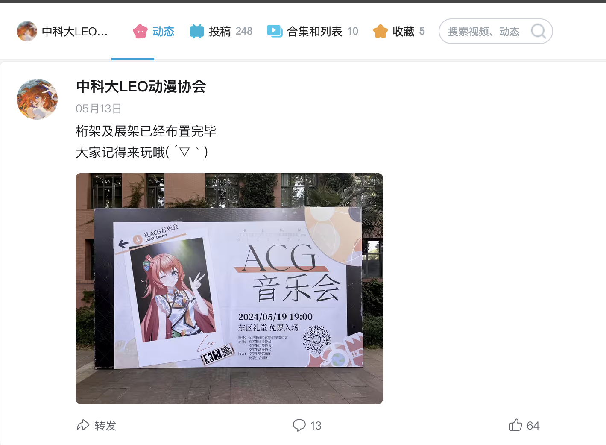  

即该题答案为：20240519  

到此完成问题一与问题二，flag为：flag{5UB5CR1B3_T0_L30_CH4N_0N_B1L1B1L1_PLZ_0f3f836cfc}  

大家快去关注Leo的B站官号！！！  

***
## 问题三
这个公园的名称是什么？（不需要填写公园所在市区等信息）

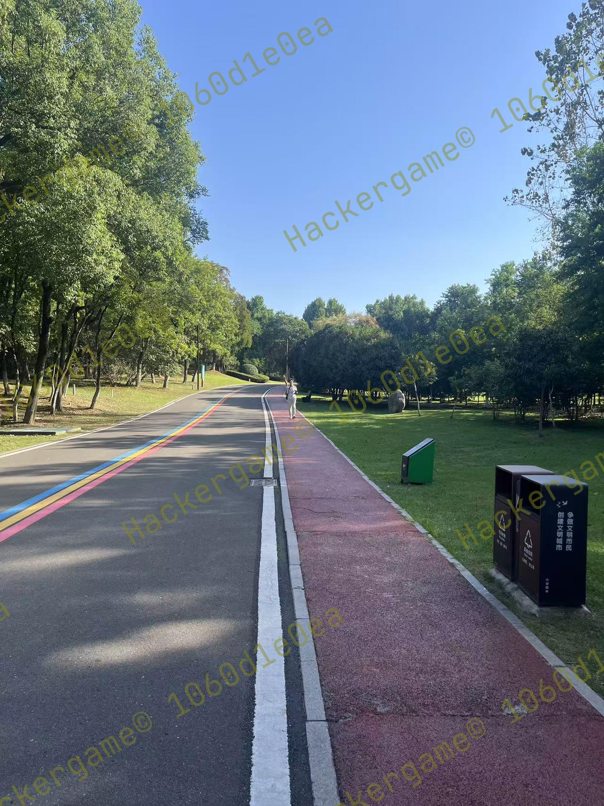  

图片一看确实没什么头绪，是一般公园都会有的景观步道，但放大右下角的垃圾桶可见“六安园林“字样，可定位该公园位于安徽六安。经过以图搜图并未找到类似的地点。经过观察周边植被茂密，树木较多，可估计该公园面积较大且符合树木密集的特征，由此从搜索给出的中央森林公园开始查找。通过搜图功能搜索“安徽六安”“中央森林公园”关键词发现了符合题图中的景观步道的的图片（来自小红书），因此确定该公园为中央森林公园。  

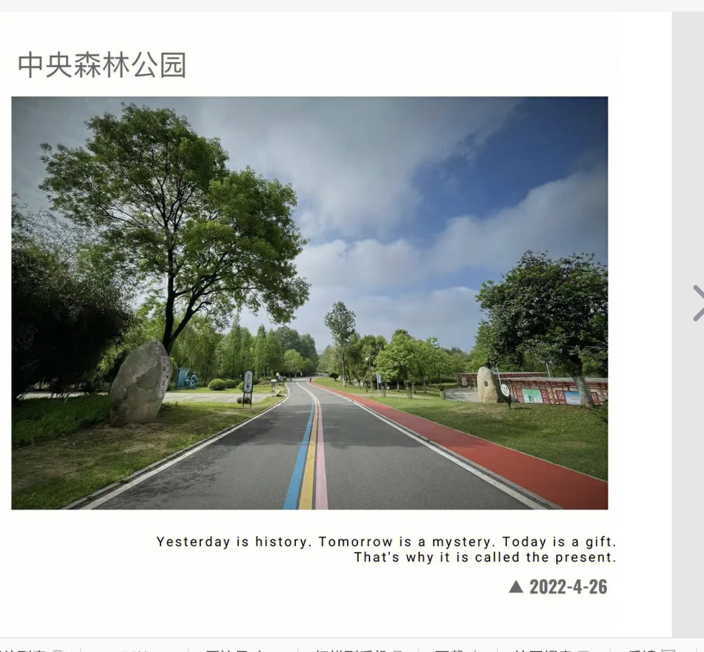  

即该题答案为：中央森林公园  

***
## 问题四
这个景观所在的景点的名字是？（三个汉字）  

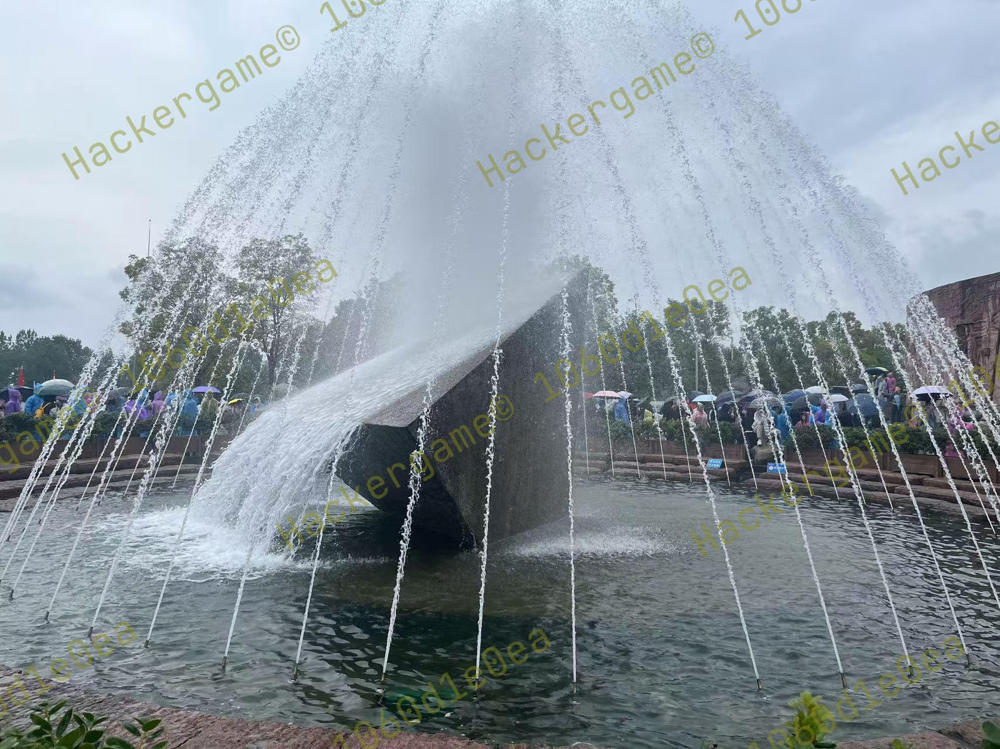  

经过题目中“而且这两张照片拍摄地的距离……是不是有点远？“可得出该地点大概率不位于安徽六安及其周边。因照片特征过于突出所以直接尝试以图搜图，可在搜图结果中发现不少打卡图片，从中该石头的名字叫“截流石”，位于湖北宜昌的三峡风景区内。由于本题要求景观所在的景点名字，可直接百度“截流石”得到结果。  

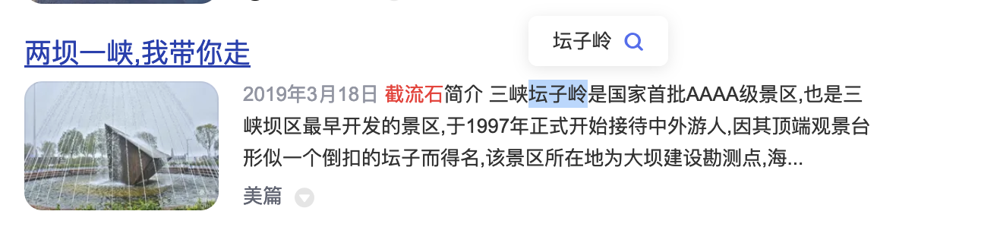  

即该题答案为：坛子岭  

到此问题三与问题四完成，flag为flag{D3T41LS_M4TT3R_1F_R3V3RS3_S34RCH_1S_1MP0SS1BL3_192b037fd1}  

细节.jpg

***
## 问题五，六
问题 5: 距离拍摄地最近的医院是？（无需包含院区、地名信息，格式：XXX医院）  
问题 6: 左下角的动车组型号是？  

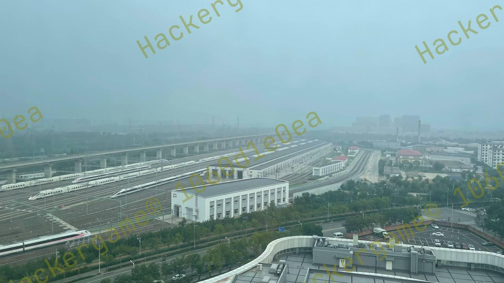

从这里开始上难度了，该题图片几乎提取不到任何有效信息。从题干当中的提示“有辆很标志性的……四编组动车？“可知，~~火车迷来了~~，该题的突破口即寻找该辆特殊的四编组动车。因为我对交运较为了解，便直接使用ChinaEMU网站开始搜索四编组动车，很快我就锁定了结果。  

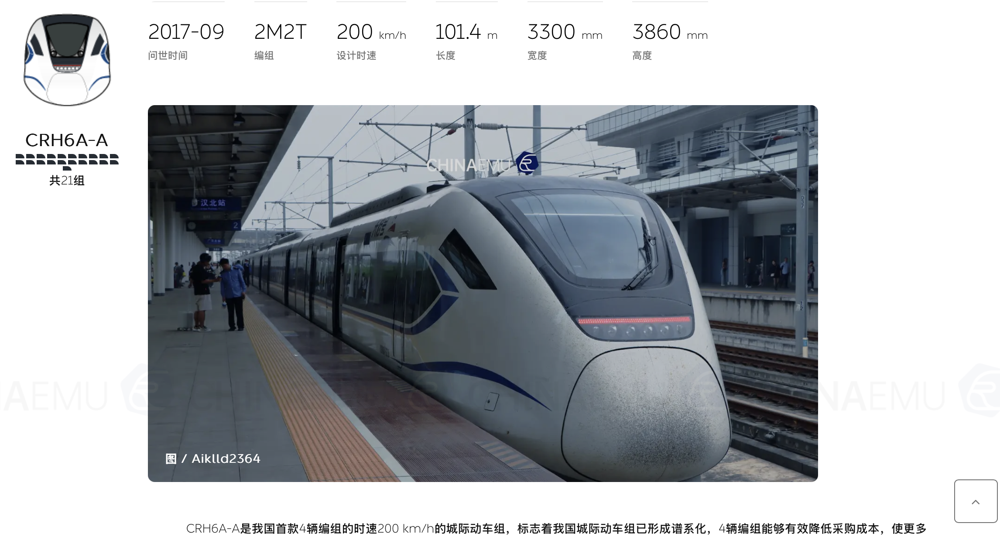  

找到车型后便向百度开始搜索该车型信息，很快就发现了与题图极其相似的涂装。因此初步确定该车型途径的路线为怀密线。运行在该线路上的车型可见为  
CRH6F-A。  

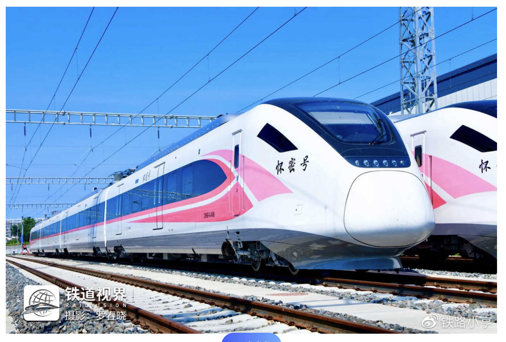  

之后顺着怀密线查找，可以在北京市密云区古北口镇找到位于此处的古北口站。根据卫星地图可以发现此处的车辆所与题图上的一致。再查找附近的医院即为北京积水潭医院。  

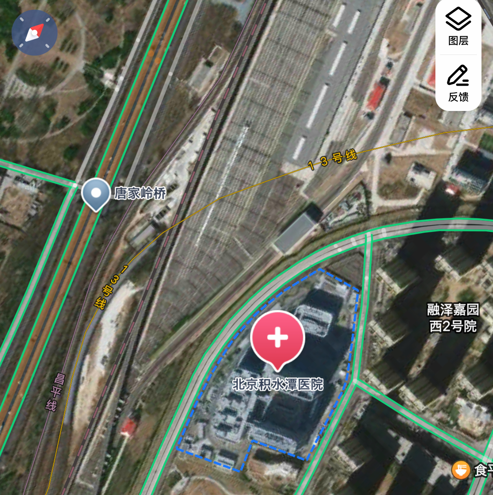  

即该两题答案为：积水潭医院，CRH6F-A。  

到此问题五，六完成，flag为flag{1_C4NT_C0NT1NU3_TH3_5T0RY_4NYM0R3_50M30N3_PLZ_H3LP_ea7e64bf2e}  

请继续你的旅行故事（坏笑  

***
### 后记
非常感谢组委会出的有意思的题目，又是猜飞机又是猜火车的（笑。不过这些题做下来包括查资料，搜图，翻卫星图片还是花了不少时间，最终解出来的感觉还是非常开心的！ ~~（因为计算机半瓶水所以不会做其他题的飘过）~~ 期待下一次能遇到更有趣的题目，同时也提醒大家要注意保护个人隐私安全哦！